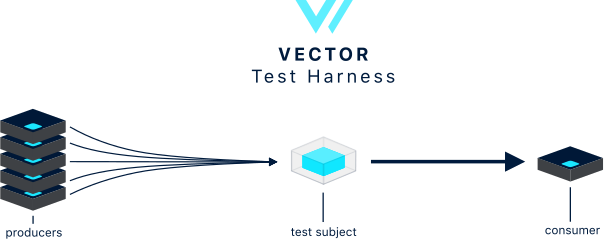

<p align="center">
  
</p>
<br />

Full end-to-end test harness for the [Vector][vector] log & metrics router. This is the
test framework used to generate the [performance] and [correctness] results displayed in the
[Vector docs][vector_docs]. You can learn more about how this test harness works in the
[How It Works][how_it_works] section, and you can begin using this test harness via the
[Usage][usage] section.

---

***Contributions for additional benchmarks and tools are welcome! As required by the
[MPL 2.0 License](LICENSE), changes to this code base, including additional benchmarks
and tools, must be made in the open. Please be skeptical of tools making performance
claims without doing so in the public. The purpose of this repository is to create
transparency around benchmarks and the resulting performance.***

### TOC

* [Results][results]
* [Directories][directories]
* [Setup][setup]
* [Usage][usage]
* [Development][development]
* [Debugging][debugging]
* [How It Works][how_it_works]

### Performance Tests

* [**`disk_buffer_performance` test**](cases/disk_buffer_performance)
* [**`file_to_tcp_performance` test**](cases/file_to_tcp_performance)
* [**`tcp_to_blackhole_performance` test**](cases/tcp_to_blackhole_performance)
* [**`tcp_to_tcp_performance` test**](cases/tcp_to_tcp_performance)
* [**`tcp_to_http_performance` test**](cases/tcp_to_http_performance)
* [**`regex_parsing_performance` test**](cases/regex_parsing_performance)

### Correctness Tests

* [**`disk_buffer_persistence_correctness` test**](cases/disk_buffer_persistence_correctness)
* [**`file_rotate_create_correctness` test**](cases/file_rotate_create_correctness)
* [**`file_rotate_truncate_correctness` test**](cases/file_rotate_truncate_correctness)
* [**`file_truncate_correctness` test**](cases/file_truncate_correctness)
* [**`sighup_correctness` test**](cases/sighup_correctness)
* [**`wrapped_json_correctness` test**](cases/wrapped_json_correctness)

---

## Directories

* [`/ansible`](/ansible) - global ansible resources and tasks
* [`/bin`](/bin) - contains all scripts
* [`/cases`][cases] - contains all test cases
* [`/packer`](/packer) - packer script to build the AMIs necessart for tests
* [`/terraform`](/terraform) - global terraform state, resources, and modules

## Setup

1. Ensure you have [Ansible][ansible] (2.7+) and [Terraform][terraform] (0.12.20+) installed.
2. This step is optional, but highly recommended. Setup a [`vector`][vector] specific
   [AWS profile][aws_profile] in your `~/.aws/credentials` file. We highly recommend running the
   Vector test harness in a separate AWS sandbox account if possible.
3. [Create an Amazon compatible key pair][create_keys]. This will be used for SSH access to test
   instances.
4. Run `cp .envrc.example .envrc`. Read through the file, update as necessary.
5. Run `source .envrc` to prepare the environment. Alternatively install [direnv] to do this
   automatically.
   Note that the `.env` file, if it exists, will be automatically sourced into
   the scripts environment - so it's another option to set the environment
   variables for the `bin/*` commands of this repo.
6. Run:

   ```bash
   ./bin/test -t [tcp_to_tcp_performance]
   ```

   This script will take care of running the necessary Terraform and Ansible scripts.

## Usage

* [`bin/build-amis`][build-amis] - builds AMIs for use in test cases
* [`bin/compare`][compare] - compare of test results across all subjects
* [`bin/ssh`][test] - utility script to SSH into a test server
* [`bin/test`][test] - run a specific test

## Results

* High-level results can be found in the Vector [performance] and [correctness] documentation
  sections.
* Detailed results can be found within each [test case's][cases] README.
* Raw performance result data can be found in our public [S3 bucket][s3_bucket].
* You can run your own queries against the raw data. See the [Usage][usage] section.

## Development

### Adding a test

We recommend cloning a similar to test since it removes a lot of the boilerplate. If you prefer
to start from scratch:

1. Create a new folder in the [`/cases`][cases] directory. Your name should end with
   `_performance` or `_correctness` to clarify the type of test this is.
2. Add a `README.md` providing an overview of the test. See the
   [`tcp_to_tcp_performance`][tcp_to_tcp_performance] test for an example.
3. Add a `terraform/main.tf` file for provisioning test resources.
4. Add a `ansible/bootstrap.yml` to bootstrap the environment.
5. Add a `ansible/run.yml` to run the test againt each subject.
6. Add any additional files as you see fit for each test.
7. Run `bin/test -t <name_of_test>`.

### Changing a test

You should _not_ be changing tests with historical test data. You can change test subject versions
since test data is [partitioned by version][data_location], but you _cannot_ change a test's
execution strategy as this would corrupt historical test data. If you need to change the test
in such a way that would violate historical data we recommend creating an entirely new test.

### Deleting a test

Simply delete the folder and any data in the [s3 bucket][s3_bucket].

## Debugging

### On a VM end

If you encounter an error it's likely you'll need to SSH onto the server to
investigate.

#### SSHing

```bash
ssh  -o 'IdentityFile="~/.ssh/vector_management"' ubuntu@51.5.210.84
```

Where:

* `~/.ssh/vector_management` = the `VECTOR_TEST_SSH_PRIVATE_KEY` value provided in your `.envrc` file.
* `ubuntu` = the default root username for the instance.
* `51.5.210.84` = the _public_ IP address of the instance.

We provide a command that wraps the system `ssh` and provides the same
credentials that ansible uses when connecting to the VM:

```bash
./bin/ssh 51.5.210.84
```

#### Viewing logs

All services are configured with systemd where their logs can be accessed with
`journalctl`:

```shell
sudo journactl -fu <service>
```

#### Failed services

If you find that the service failed to start, I find it helpful to manually
attempt to start the service by inspecting the command in the `.service` file:

```shell
cat /etc/systemd/system/<name>.service
```

Then copy the command specified in `ExecStart` and run it manually. Ex:

```shell
/usr/bin/vector
```

### On your end

Things can go wrong on your end (i.e. on the local system you're running the
test harness) too.

#### Ansible Task Debugger

```bash
export ANSIBLE_ENABLE_TASK_DEBUGGER=True
```

Set the environment variable above, and Ansible will drop you in a debug mode on any task failure.

See Ansible documentation on [Playbook Debugger](https://docs.ansible.com/ansible/latest/user_guide/playbooks_debugger.html) to learn more.

Some useful commands:

```python
pprint task_vars['hostvars'][str(host)]['last_message']
```

#### Verbose Ansible Execution

```bash
export ANSIBLE_EXTRA_ARGS=-vvv
```

Set the environment variable above, and Ansible will print verbose debug
information for every task it executes.

## How It Works

### Design

The Vector test harness is a mix of [bash][bin], [Terraform][terraform], and [Ansible][ansible]
scripts. Each test case lives in the [`/cases`][cases] directory and has full reign of it's
bootstrap and test process via it's own [Terraform][terraform] and [Ansible][ansible] scripts.
The location of these scripts is dictated by the [`test`][test] script and is outlined in more
detail in the [Adding a test][adding_a_test] section. Each test falls into one of 2 categories:
performance tests and correctness tests:

#### Performance tests

Performance tests measure performance and MUST capture detailed performance data as outlined
in the [Performance Data][performance_data] and [Rules][rules] sections.

In addition to the `test` script, there is a [`compare`][compare] scripts.
This script analyzes the performance data captured when executing a test. More information
on this data and how it's captured and analyzed can be found in the
[Performance Data][performance_data] section. Finally, each [script][bin] includes a usage
overview that you can access with the `--help` flag.

##### Performance data

Performance test data is captured via [`dstat`][dstat], which is a lightweight utility that
captures a variety of system statistics in 1-second snapshot intervals. The final result is a CSV
where each row represents a snapshot. You can see the [`dstat` command][dstat_command] used in the
[`ansible/roles/profiling/start.yml`][profiling_start] file.

###### Performance data schema

The performance data schema is reflected in the [Athena table definition][athena_table] as
well as the CSV itself. The following is an ordered list of columns:

| Name            |   Type    |
|:----------------|:---------:|
| `epoch`         | `double`  |
| `cpu_usr`       | `double`  |
| `cpu_sys`       | `double`  |
| `cpu_idl`       | `double`  |
| `cpu_wai`       | `double`  |
| `cpu_hiq`       | `double`  |
| `cpu_siq`       | `double`  |
| `disk_read`     | `double`  |
| `disk_writ`     | `double`  |
| `io_read`       | `double`  |
| `io_writ`       | `double`  |
| `load_avg_1m`   | `double`  |
| `load_avg_5m`   | `double`  |
| `load_avg_15m`  | `double`  |
| `mem_used`      | `double`  |
| `mem_buff`      | `double`  |
| `mem_cach`      | `double`  |
| `mem_free`      | `double`  |
| `net_recv`      | `double`  |
| `net_send`      | `double`  |
| `procs_run`     | `double`  |
| `procs_bulk`    | `double`  |
| `procs_new`     | `double`  |
| `procs_total`   | `double`  |
| `sys_init`      | `double`  |
| `sys_csw`       | `double`  |
| `sock_total`    | `double`  |
| `sock_tcp`      | `double`  |
| `sock_udp`      | `double`  |
| `sock_raw`      | `double`  |
| `sock_frg`      | `double`  |
| `tcp_lis`       | `double`  |
| `tcp_act`       | `double`  |
| `tcp_syn`       | `double`  |
| `tcp_tim`       | `double`  |
| `tcp_clo`       | `double`  |

###### Performance data location

All performance data is made public via the [`vector-tests` S3 bucket][s3_bucket] in the
`us-east-1` region. The partitioning structure follows the Hive partitioning structure with
variable names in the path. For example:

```
name=tcp_to_tcp_performance/configuration=default/subject=vector/version=v0.2.0-dev.1-20-gae8eba2/timestamp=1559073720
```

And the same in a tree form:

```
name=tcp_to_tcp_performance/
  configuration=default/
    subject=vector/
      version=v0.2.0-dev.1-20-gae8eba2/
        timestamp=1559073720
```

* `name` = the test name.
* `configuration` = refers to the test's specific configuration (tests can have multiple configurations
  if necessary).
* `subject` = the test subject, such as `vector`.
* `version` = the version fo the test subject.
* `timestamp` = when the test was executed.

###### Performance data analysis

Analysis of this data is performed through the [AWS Athena service][aws_athena]. This allows us
to execute complex queries on the [performance data][performance_data] stored in S3. You can see
the queries ran in the [`compare`][compare] script.

#### Correctness tests

Correctness tests simply verify behavior. These tests are not required to capture or to persist
any data. The results can be manually verified and placed in the test's README.

##### Correctness data

Since correctness tests are pass/fail there is no data to capture other than the successful
running of the test.

##### Correctness output

Generally, correctness tests verify the output. Because of the various test subjects, we use a variety
of output methods to capture output (tcp, http, and file). This is highly dependent on the test
subject and the methods available. For example, the Splunk Forwarders only support TCP and
Splunk specific outputs.

To make capturing this data easy, we created a [`test_server` Ansible role][test_servers_role]
that spins up various test servers and provides a simple way to capture summary output.

### Environments

Tests must operate in isolated reproducible environments, they must _never_ run locally.
The obvious benefit is that it removes variables across tests, but it also improves collaboration
since remote environments are easily accessible and reproducible by other engineers.

### Rules

1. ALWAYS filter to resources specific to your `test_name`, `test_configuration`, and
   `user_id` (ex: ansible host targeting)
2. ALWAYS make sure the initial instance state is identical across test subjects. We recommend explicitly
   stopping all test subjects to properly handle the case of preceding failure and the situation where a
   subject was not cleanly shutdown.
3. ALWAYS use the [`profile` ansible role][profiling_role] to capture data. This ensures a consistent
   data structure across tests.
4. ALWAYS run performance tests for at least 1 minute to calculate a 1m CPU load average.
5. Use [ansible roles][roles] whenever possible.
6. If you are not testing local data collection we recommend using TCP as a data source since
   it is a lightweight source that is more likely to be consistent, performance wise, across
   subjects.


[adding_a_test]: #adding-a-test
[ansible]: https://www.ansible.com/
[athena_table]: /terraform/data.tf
[aws_athena]: https://aws.amazon.com/athena/
[aws_cli]: https://aws.amazon.com/cli/
[aws_profile]: https://docs.aws.amazon.com/cli/latest/userguide/cli-configure-profiles.html
[bin]: /bin
[build-amis]: bin/build-amis
[cases]: /cases
[compare]: bin/compare
[correctness]: https://vector.dev/#correctness
[create_keys]: https://docs.aws.amazon.com/AWSEC2/latest/UserGuide/ec2-key-pairs.html
[data_location]: #performance-data-location
[debugging]: #debugging
[development]: #development
[directories]: #directories
[direnv]: https://direnv.net/
[dstat]: http://dag.wiee.rs/home-made/dstat/
[dstat_command]: /ansible/roles/profiling/tasks/start.yml
[how_it_works]: #how-it-works
[performance]: https://vector.dev/#performance
[performance_data]: #performance-data
[profiling_role]: /ansible/roles/profiling
[profiling_start]: /ansible/roles/profiling/tasks/start.yml
[results]: #results
[roles]: /ansible/roles
[rules]: #rules
[s3_bucket]: https://s3.console.aws.amazon.com/s3/buckets/vector-tests/?region=us-east-1
[setup]: #setup
[test_servers_role]: /ansible/roles/test_servers
[tcp_to_tcp_performance]: cases/tcp_to_tcp_performance
[terraform]: https://www.terraform.io/
[test]: bin/test
[usage]: #usage
[vector]: https://github.com/timberio/vector
[vector_docs]: https://docs.vector.dev/
